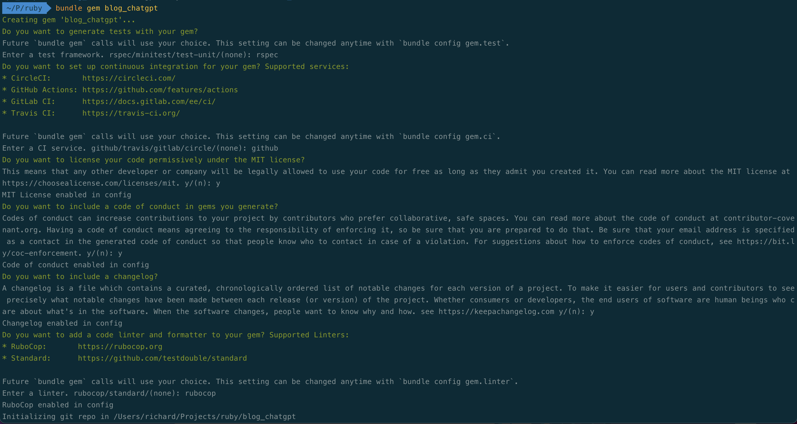
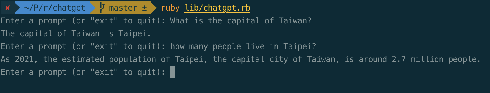

If you haven't had the chance to try out ChatGPT yet, it's time to come out from under that rock. This AI marvel is one
of the most innovative tools we've seen in years and has taken the tech world by storm!

If you haven't checked it out yet, head over to https://chat.openai.com and sign up. ChatGPT is capable of replying to a
variety of prompts, from

> "What is 12 \* 12?"

to

> "In a dystopian future, humanity has abandoned Earth and terraformed Mars, creating a new utopia. However, a group of
> rebels emerges, fighting for the right to return to their home planet. Write a story exploring the ethical dilemmas
> and
> consequences of this conflict."

But why should we limit ourselves to using ChatGPT only through the website? Wouldn't it be great if we could access
this API from the comfort of our command line? We are software engineers, after all!

In this blog post, I'm going to first walk through how to connect to the chatGPT API with some ruby code and then
finally convert the code into a publishable gem that you can share with the community and run from anywhere in your
terminal.

## Getting access to the API

Before we can start making requests to the ChatGPT API, we need an API key for authentication. Head over
to https://auth0.openai.com/u/signup and create an account if you have not yet done so. Once signed up, you can create
an API key via https://platform.openai.com/account/api-keys.

## Interacting with ChatGPT

The OpenAI team provides quite a few endpoints, but the one we're interested in is `chat`
at https://api.openai.com/v1/chat/completions. Below is an example curl request to this API (note that the API key
has been hidden, `XXXXX`):

```shell{outputLines: 2-8}{promptUser: rich}{promptHost: localhost}
curl https://api.openai.com/v1/chat/completions \
  -H "Content-Type: application/json" \
  -H "Authorization: Bearer XXXXX" \
  -d '{
     "model": "gpt-3.5-turbo",
     "messages": [{"role": "user", "content": "What is the capital of Taiwan?"}],
     "temperature": 0.7
   }'

```

In this code, we are making an HTTP POST request to https://api.openai.com/v1/chat/completions, passing in the API key
we created in the header as well as body parameters for the `model`, `temperature` as well as `messages` ie. our prompt.
You can see the JSON response we get back below - note the ChatGPT response nested
inside `"choices"[0]["message"]["content"]` :

```JSON
{
  "id": "chatcmpl-7Cv0NoaKHrvKIj2f600nNFgVenZlM",
  "object": "chat.completion",
  "created": 1683313419,
  "model": "gpt-3.5-turbo-0301",
  "usage": {
    "prompt_tokens": 15,
    "completion_tokens": 7,
    "total_tokens": 22
  },
  "choices": [
    {
      "message": {
        "role": "assistant",
        "content": "The capital of Taiwan is Taipei."
      },
      "finish_reason": "stop",
      "index": 0
    }
  ]
}
```

## Creating our own ruby gem

To start creating your own Ruby gem that utilizes ruby-openai, make sure you have bundler installed by
running `bundle -v`. Then, create your gem with any name you desire using the following command:

```shell{promptUser: rich}{promptHost: localhost}
bundle gem <YOUR_GEM_NAME>
cd <YOUR_GEM_NAME>

```

After running this command, bundler will prompt you to configure some extra settings before creating your gem directory.
While we won't be writing tests or setting up a CI in this blog post, it's good practice to initialize them in case you
need them in the future. You should therefore choose the following configurations:



After selecting your desired configurations, bundler will create a new directory with the necessary files and initialize
a git repository. Going forward, I will be providing code snippets from my own created gem called `chatgpt`.

---

```shell:title=chatgpt/
├── CHANGELOG.md
├── CODE_OF_CONDUCT.md
├── Gemfile
├── LICENSE.txt
├── README.md
├── Rakefile
├── bin
│   ├── console
│   └── setup
├── chatgpt.gemspec
├── lib
│   ├── chatgpt
│   │   └── version.rb
│   └── chatgpt.rb
├── sig
│   └── chatgpt.rbs
└── spec
    ├── chatgpt_spec.rb
    └── spec_helper.rb
```

## Exploring the gem directory

As you can see, the directory looks very similar to a normal Ruby program that you have hopefully built before:

- `Rakefile` => Any rake tasks we need to run can be written here. Bundler has already added the `build`, `install`
  and `release` tasks.
- `Gemfile` => Specifies any gems depended on by your library. We will add these to the `.gemspec` instead, which can be
  seen loaded in the `gemspec` line.
- `spec` => Contains any tests that we write.
- `lib/blog_chatgpt.rb` => This is the main file to define our code. It is required by Bundler when your gem is loaded.
- `lib/blog_chatgpt` => Contains any other business logic such as classes or clients required by `lib/blog_chatgpt.rb`.

One of the most important files for a Ruby gem that you won't see in normal Ruby programs is the `.gemspec` file. The
gemspec contains information and metadata regarding your gem, such as its name, version, authors, summary, homepage, and
more. If you take a look at any popular gem hosted on RubyGems, such as [Rails](https://rubygems.org/gems/rails), you
will see that the information displayed on the gem's page, including its `name`, `version`, `authors`, `summary`,
and `homepage`, all comes from the `.gemspec` file.

Go through this file and update it accordingly with your details as the author. `homepage`, `source_code_uri`
and `changelog_uri` can be left blank for now as we have not yet published the git repository or ruby gem. You will end
up with something like below:

```ruby:title=chatgpt.gemspec
# frozen_string_literal: true

require_relative "lib/chatgpt/version"

Gem::Specification.new do |spec|
  spec.required_ruby_version = ">= 2.6.0"
  spec.name                  = "chatgpt"
  spec.version               = Chatgpt::VERSION
  spec.authors               = ["Richard Bates"]
  spec.email                 = ["rich.bates@protonmail.com"]

  spec.description           = "CLI interface for OpenAI ChatGPT in Ruby"
  spec.summary               = spec.description
  spec.license               = "MIT"

  spec.files = Dir.chdir(__dir__) do
    `git ls-files -z`.split("\x0").reject do |f|
      (f == __FILE__) || f.match(%r{\A(?:(?:bin|test|spec|features)/|\.(?:git|travis|circleci)|appveyor)})
    end
  end
  spec.executables   = spec.files.grep(%r{\Aexe/}) { |f| File.basename(f) }
  spec.require_paths = ["lib"]
end
```

After completing this step, run `bin/setup` to generate a `Gemfile.lock`. Then, commit the changes and push them to a
GitHub repository that you have created."

```shell{promptUser: rich}{promptHost: master}
bin/setup
git add .
git commit -m "Initial gem setup with updated specification"
git remote add origin git@github.com:richo225/ruby-chatgpt.git
git branch -M master
git push -u origin master
```

## Using the Ruby OpenAI gem

Now it's time to write the meat of our gem!

Earlier, we interacted successfully with the ChatGPT API, and while we could make the HTTP request using any old HTTP
client in Ruby, someone has already built a wrapper for us - [Ruby OpenAI](https://github.com/alexrudall/ruby-openai).
This gem abstracts all the OpenAI endpoints, is highly configurable, and includes extra functionality like streaming. To
make the same request as before using the gem, we can simply call `client.chat()`.

We need to add `ruby-openai` as a dependency, so when people install our gem, they must also install `ruby-openai` for
it to work. To do this, add `ruby-openai` to your gem specification:

```ruby{numberLines: 23}
spec.executables   = spec.files.grep(%r{\Aexe/}) { |f| File.basename(f) }
spec.require_paths = ["lib"]

spec.add_dependency 'ruby-openai', '~> 4.0' # highlight-line

```

After adding `ruby-openai` as a dependency, we need to run `bin/setup` to install the gem and update
the `.Gemfile.lock`. Then, we should commit the changes to the repository we created on Github. Here's how to do it:

```shell{promptUser: rich}{promptHost: master}
bin/setup
git add .
git commit -m "Adds ruby-openai gem dependency"
git push origin master
```

Now, we will add the Ruby code for making a request to ChatGPT and printing it out to the terminal inside
your `lib/YOUR_GEM_NAME.rb` file. Firstly, we should require the `ruby-openai` gem that we added as a dependency earlier
and initialize the client with our API key.

```ruby:title=lib/chatgpt.rb
# frozen_string_literal: true

require_relative "chatgpt/version"
require 'openai' # highlight-line

module Chatgpt
  class Error < StandardError; end
  # highlight-next-line
  # Your code goes here...
  # highlight-next-line
  client = OpenAI::Client.new(access_token: <YOUR_API_KEY>)

end
```

Because we are going to publish this source code to Github and via RubyGems, it is important that we do not include our
own API key, as users who install the gem would then have access to our account. Therefore, we will replace the API key
with an environment variable `ENV["OPENAI_API_KEY"]` that the user must set for themselves, and create a custom error
called `MissingApiKeyError` which will be raised if the user has not set the environment variable.

```diff{numberLines: 6}
-  class Error < StandardError; end
+  class MissingApiKeyError < StandardError; end

+  unless ENV["OPENAI_API_KEY"]
+    raise MissingApiKeyError,
+          "Please set a value for the OPENAI_API_KEY variable"
+  end
-  client = OpenAI::Client.new(access_token: <YOUR_API_KEY>)
+  client = OpenAI::Client.new(access_token: ENV["OPENAI_API_KEY"])

```

```shell{promptUser: rich}{promptHost: master}
'<module:Chatgpt>': Please set a value for the OPENAI_API_KEY variable (Chatgpt::MissingApiKeyError)
```

Set the environment variable depending on which shell you use eg. `fish`, `bash`, `zsh`

```shell{promptUser: rich}{promptHost: master}
  set -g OPENAI_API_KEY "YOUR_API_KEY_GOES_HERE"
  echo 'export OPENAI_API_KEY=YOUR_API_KEY_GOES_HERE' >> ~/.bashrc
  echo 'export OPENAI_API_KEY=YOUR_API_KEY_GOES_HERE' >> ~/.zshrc
```

## Connecting to the ChatGPT API

Now that we have the client initialised, we can begin making the request to ChatGPT using `client.chat()`.

```ruby{numberLines: 8}
  client = OpenAI::Client.new(access_token: ENV["OPENAI_API_KEY"])

  #highlight-start
  print 'Enter a prompt: '
  input = gets.chomp
  #highlight-end

  #highlight-start
  response = client.chat(
    parameters: {
      model: 'gpt-3.5-turbo', # Required.
      messages: [{ role: 'user', content: input }], # Required.
      temperature: 0.7
    }
  )
  #highlight-end

  #highlight-next-line
  puts response['choices'][0]['message']['content']
end
```

Here, we retrieve the response from the ChatGPT API and extract the value at the `"content"` key, which is then
displayed on the terminal. At this point, it's recommended to test the code by running the ruby file within the lib
directory using the command `ruby lib/<YOUR_GEM_NAME>.rb`. You will see the full response printed out below, along with
the content that was returned.



Again, don't forget to commit this feature:

```shell{promptUser: rich}{promptHost: master}
git add .
git commit -m "Request ChatGPT content and parse response"
git push origin master
```

## Continuous prompts and streaming

The current code is functional, but it only takes one input from the user and then exits. To allow the user to provide
multiple inputs, we'll wrap the code in a loop and only break out of it when the user types `exit`. Additionally, we can
improve the speed at which the output is printed by using
the [real-time streaming feature](https://github.com/alexrudall/ruby-openai#streaming-chatgpt) of the ruby-openai gem.

```ruby{numberLines: 4}{1,2,5,18, 12-14}
loop do
  print 'Enter a prompt (or "exit" to quit): '
  input = gets.chomp

  break if input.downcase == "exit"

  client.chat(
    parameters: {
      model: "gpt-3.5-turbo", # Required.
      messages: [{ role: "user", content: input }], # Required.
      temperature: 0.7,
      stream: proc do |chunk, _bytesize|
        print chunk.dig("choices", 0, "delta", "content")
      end
    }
  )

  puts
end
```

The new `stream` parameter takes a `proc` that receives the stream of text chunks back from ChatGPT as they are
generated. Proc is a block of code that can be assigned to a variable or passed around. Each time one or more text
chunks are received, the Proc is called once with each chunk. The Proc then parses the chunk as a Hash, and we print out
the `content` within this Hash.

To test this beautiful new code, we can use the interactive ruby console, `IRB`. Run the `bin/console` executable which
will run any setup, require our ruby file, and load up the interpreter:

```shell{promptUser: rich}{promptHost: master}
bin/console
=> Enter a prompt (or "exit" to quit):
```

## Sign up with RubyGems

We now have a fully working gem, but how can we share it? We could publish the repository on Github and have everyone
clone it down, run `bundle install`, and then `ruby lib/<YOUR_GEM_NAME>.rb`.But then, what was the purpose of all this
effort in creating a package if we were just going to share a single Ruby file? We're instead going to package this
source code into a gem and publish it to RubyGems so that others only need to type `gem install <YOUR_GEM_NAME>` and
then run it via `<YOUR_GEM_NAME>`.

The first thing we're going to do is commit the code we have so far via:

```shell{promptUser: rich}{promptHost: master}
git add .
git commit -m "Loop through user input and stream text chunks to stdout"
git push origin master
```

In order to push to rubygems, you must have an account. You can sign up at https://rubygems.org/sign_up.

## Building and testing the gem

To build our gem, we can run:

```shell{promptUser: rich}{promptHost: master}
gem build chatgpt
Successfully built RubyGem
  Name: chatgpt
  Version: 0.1.0
  File: chatgpt-0.1.0.gem
```

This will create a `<YOUR_GEM_NAME>-0.1.0.gem` file inside the root directory which is basically a glorifed TAR.

We can then install this gem using `gem install`

```shell
gem install chagpt-0.1.0.gem
```

However, if you try to run your gem using <YOUR_GEM_NAME>, you will get a `command not found` error which can be
frustrating for users who want to run your gem from anywhere in their terminal. To make the gem available, we need to
create an `executable` file in the `bin` directory and link it in our gem specification.

To do this, create a new file inside the `bin` directory with the name of your gem, `<YOUR_GEM_NAME>`. In this file,
require the setup executable and then require the ruby code that is doing the heavy lifting.

```ruby:title=/bin/chatgpt
#!/usr/bin/env ruby

require "bundler/setup"
require "chatgpt"
```

To make this newly created file executable, we will change the permissions mode using `chmod`:

```shell{promptUser: rich}{promptHost: master}
chmod -x bin/<YOUR_GEM_NAME>
```

So that a user can run it wherever in the terminal, we also need to make sure the executable is added to the
system `PATH` variable upon installation. To do this, simply add the line below to the gem specification:

```diff{numberLines: 21}
- spec.executables = spec.files.grep(%r{\Aexe/}) { |f| File.basename(f) }
+ spec.executables = ["chatgpt"]

```

When a user types `chatgpt` in their terminal, the gem will now look inside the `bin` directory for an executable
called `chatgpt`.

Let's commit this change:

```shell{promptUser: rich}{promptHost: master}
git add .
git commit -m "Adds chatgpt executable with correct permissions"
git push origin master
```

## Gem versioning

The `<YOUR_GEM_NAME>::VERSION` constant inside the gem specification earlier may have caught your attention. It is
defined in your `lib/YOUR_GEM_NAME/version.rb` and currently has a value of `0.1.0`. This is an example of something
called [semantic versioning](https://semver.org/) which has a set of rules and requirements for constructing version
numbers. A version consists of three parts: `major`, `minor`, and `patch`, forming the full version
of `major.minor.patch`. Therefore, our gem currently has a minor version of 1 and 0 for major and patch.

Since our gem has not been published to RubyGems yet, there is no need to change the version from `0.1.0`. Any user who
installs our gem will not have to worry about which version to install since there will be only one.

Before we move forward with publishing this gem version, it is a good time to add a `git tag` to the latest commit to
indicate which part of our code history is a specific version and then push it up to GitHub.

```shell{promptUser: rich}{promptHost: master}
git tag -a v0.1.0 -m "Initial v0.1.0"
git push origin v0.1.0
```

## Publishing the gem

We can now publish the built gem in our directory to RubyGems via:

```shell{promptUser: rich}{promptHost: master}
# highlight-next-line
gem push <YOUR_GEM_NAME>-0.1.0.gem
# input your rubygems credentials when prompted
```

Head over to https://rubygems.org/ and search for your gem. If everything went smoothly, you should be able to see your
newly created gem page, complete with all the correct specifications and a single version listed as 0.1.0. From here,
anyone can easily install your gem by simply running `gem install <YOUR_GEM_NAME>`.

## Making changes to your gem

One of the rules of [semantic versioning](https://semver.org/) is that:

> Once a versioned package has been released, the contents of that version MUST NOT be modified. Any modifications MUST
> be released as a new version

For example, let's say we now decide to change the ChatGPT model from `'gpt-3.5-turbo'` to `'gpt-2.5'` and we commit
this change.

```diff{numberLines: 18}
-   model: "gpt-3.5-turbo", # Required.
+   model: "gpt-2.5", # Required.

```

```shell{promptUser: rich}{promptHost: master}
git commit -m "Changes desired model from gpt-3.5-turbo to gpt-2.5"
git push origin master
```

This change may seem small, but it can have significant implications for users dependent on the gem with the previous
version of the ChatGPT model. It's crucial to follow the semver rules when releasing an updated gem version, as it
allows users to understand the implications of upgrading to the new version. The contents of `0.1.0` MUST NOT be
modified as per the rules, and thus we need to release our updated gem under a new version.

But what version do we change it to? Is this a major change, a minor or a patch? The semver rules state:

> 1. MAJOR version when you make incompatible API changes
> 2. MINOR version when you add functionality in a backwards compatible manner
> 3. PATCH version when you make backwards compatible bug fixes

In this case, the change from gpt-3.5-turbo to gpt-2.5 IS backward compatible and won't break any code. As a result, we
will make a minor version change and update the gem version from `0.1.0` to `0.2.0`. To do this, simply change the value
of the `<YOUR_GEM_NAME>::VERSION` constant in the `lib/YOUR_GEM_NAME/version.rb` file. We then update the `Gemfile.lock`
gem version via `bundle install`, commit the changes and tag the commit:

```diff:title=lib/chatgpt/version.rb
module Chatgpt
- VERSION = "0.1.0"
+ VERSION = "0.2.0"
end

```

```shell{promptUser: rich}{promptHost: master}
bin/setup
git commit -m "Bump <YOUR_GEM_NAME> v0.2.0"
git tag -a v0.2.0 -m "Bump to v0.2.0"
git push origin master
```

Now we can build the gem again for 0.2.0 and publish this new version to rubygems:

```shell{promptUser: rich}{promptHost: master}
gem build <YOUR_GEM_NAME>
gem push <YOUR_GEM_NAME>-0.2.0.gem
```

Congratulations! Your new gem version is now available on RubyGems. To install it globally, run:

```shell{promptUser: rich}{promptHost: master}
gem install <YOUR_GEM_NAME>
```

And run it from wherever you are in the terminal via:

```shell{promptUser: rich}{promptHost: master}
<YOUR_GEM_NAME>
```

## Summary

There are many more features we could add to this gem in the future:

- Want to supercharge your gem and let users interact with other OpenAI endpoints using CLI arguments or flags?
  The [Thor toolkit](https://github.com/rails/thor) has got your back.
- Don't forget to add tests for the existing functionality. We all love a bug-free gem, right?
- You can also use the existing bundler rake tasks for publishing to RubyGems.
- Finally, you can make your gem even more awesome by adding a CI pipeline. This will help you catch issues early on and
  ensure your gem is always in tip-top shape.

I hope you found this article helpful, and that it inspires you to build and share more Ruby gems! If you're curious,
the source code is available on [GitHub](https://github.com/richo225/ruby-chatgpt) and the published gem can be found
on [RubyGems](https://rubygems.org/gems/ruby-chatgpt).
