<figure>
  
  <figcaption class="photo-caption">
    Photo by <a href="https://unsplash.com/@_everaldo?utm_content=creditCopyText&utm_medium=referral&utm_source=unsplash">Everaldo Coelho</a> on <a href="https://unsplash.com/photos/KPaSCpklCZw?utm_content=creditCopyText&utm_medium=referral&utm_source=unsplash">Unsplash</a>
  </figcaption>
</figure>

If you are into web development, you must have come across the term "Lighthouse score". It is a unanimous way of measuring how well the website performs in the wild. To measure the Lighthouse score, you can use Lighthouse. Lighthouse is an open-source tool that monitors and measures your website's performance, quality, and correctness.

Lighthouse lets you to start quickly and measure your website directly in the browsers. Some teams and companies run Lighthouse on each change/push. That is where Lighthouse CI (LHCI) steps in. LHCI helps you run Lighthouse in continuous integration (CI) environments.

After LHCI runs, it can upload results to a temporary storage provided by Google, or, it can upload results to a server somewhere. Today, we are going to learn how to deploy and then configure the Lighthouse CI Server so that we can collect Lighthouse scores and compare them over time.

## Prerequisites

In this blog post, we will use this blog - [Pragmatic Pineapple](https://github.com/nikolalsvk/blog) to measure its Lighthouse score. You can use your website if you want, the idea is to a website to measure.

For deployment, we are going to use Railway. Railway is a platform that makes deploying apps easy, by providing a scalable cloud infrastructure. To prepare, you'll need:

- A [Railway](https://railway.app/) account
- The [Railway CLI](https://docs.railway.app/develop/cli) installed
- GitHub repo with a project you want to test with Lighthouse

## Step 1 - Initialize Project

First, we will create a new project to host our Lighthouse server code. I named it `lighthouse-server` and I'll host it on GitHub.

I created the directory and went inside it:

```bash
mkdir lighthouse-server && cd lighthouse-server
```

The project will be simple, with a couple of essential dependencies in `package.json` as seen below:

```json
{
  "name": "lighthouse-server",
  "version": "1.0.0",
  "description": "Nikola's Lighthouse Server",
  "main": "index.js",
  "scripts": {
    "start": "node index.js",
    "deploy": "railway up --service=lighthouse-server --environment=production"
  },
  "keywords": [],
  "author": "",
  "license": "ISC",
  "dependencies": {
    "@lhci/server": "^0.12.0",
    "pg": "^8.11.3",
    "pg-hstore": "^2.3.4"
  }
}
```

Also, we'll need the `index.js` that will spin up the LHCI server:

```js
"use strict"

const { createServer } = require("@lhci/server")

console.log("Starting server...")
createServer({
  port: process.env.PORT,
  storage: {
    storageMethod: "sql",
    sqlDialect: "postgres",
    sqlConnectionSsl: true,
    sqlConnectionUrl: process.env.DATABASE_URL,
  },
  /* If you need basic auth uncomment this section
  basicAuth: {
    username: process.env.BASIC_AUTH_USERNAME,
    password: process.env.BASIC_AUTH_PASSWORD,
  },
  */
}).then(({ port }) => console.log("Listening on port", port))
```

Or, if you don't want to copy text as much, run these two commands:

```bash
curl https://raw.githubusercontent.com/nikolalsvk/lighthouse-server/main/package.json > package.json
curl https://raw.githubusercontent.com/nikolalsvk/lighthouse-server/main/index.js > index.js
```

And we are good so far. We now need to deploy the project to Railway. Let's see how to do that.

## Step 2 - Deploy to Railway

After we created a new directory with `package.json` and `index.js`, it's time to deploy it to Railway.

First, we need to run `railway login` to log in, and then `railway init`.
Here's how that looked on my machine:

```bash
$ railway login
> Open the browser? Yes
Logged in as Nikola (nikola@myemail.com)

$ railway init
> Team Personal
> Project Name lighthouse-server
Created project lighthouse-server on Personal
https://railway.app/project/xxxx-xxxx-xxxx-xxxx
```

Then, we'll deploy the actual project with `railway up --detach` (the `--detach` flag is there to make sure we're not listening to logs of the server).
The command will complete pretty quickly and it will trigger a deployment on Railway. You can follow the build logs returned from the command.

```bash
$ railway up --detach
Indexed
Compressed [====================] 100%
Uploaded
Build Logs: https://railway.app/project/6c35cf2c-d129-4fa4-b224-144a99e96e4b/service/e8f9b583-409a-4109-9604-96e6560bdd25?id=4366fee8-5544-4c0f-a77b-6cb1d969ece9&
```

The deployment finished in under a minute for me and I got this build log:

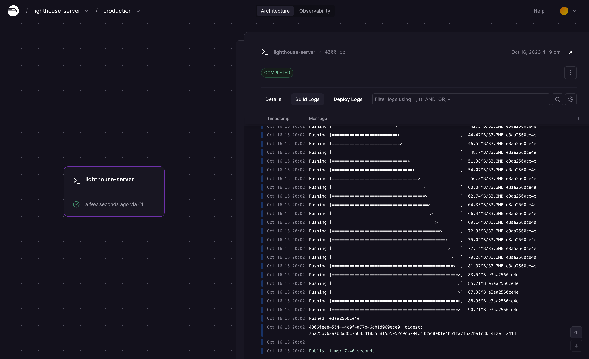

Hm, but the server crashed 🤔. What could be the problem?

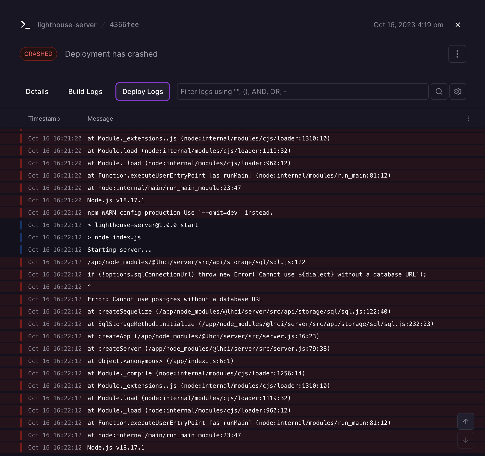

Ah, we don't have a database for our server. We'll fix this in the next section.

## Step 3 - Add a PostgreSQL Database

To add a database for our LHCI server to store data, we'll run `railway add`.

```bash
$ railway add
> Select plugins to add PostgreSQL
Created PostgreSQL
```

Choose a PostgreSQL by pressing Space and then Enter. Now, a PostgreSQL will be added to our personal space on Railway.

Now, we'll connect the `lighthouse-server` service we created, and the PostgreSQL database we added.
Open the Railway and select the `lighthouse-server` service and enter the `Variables` tab like so:

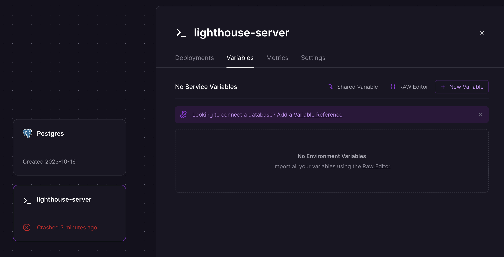

Then, click the "Add a Variable Reference" link and you should see a dropdown open like so:

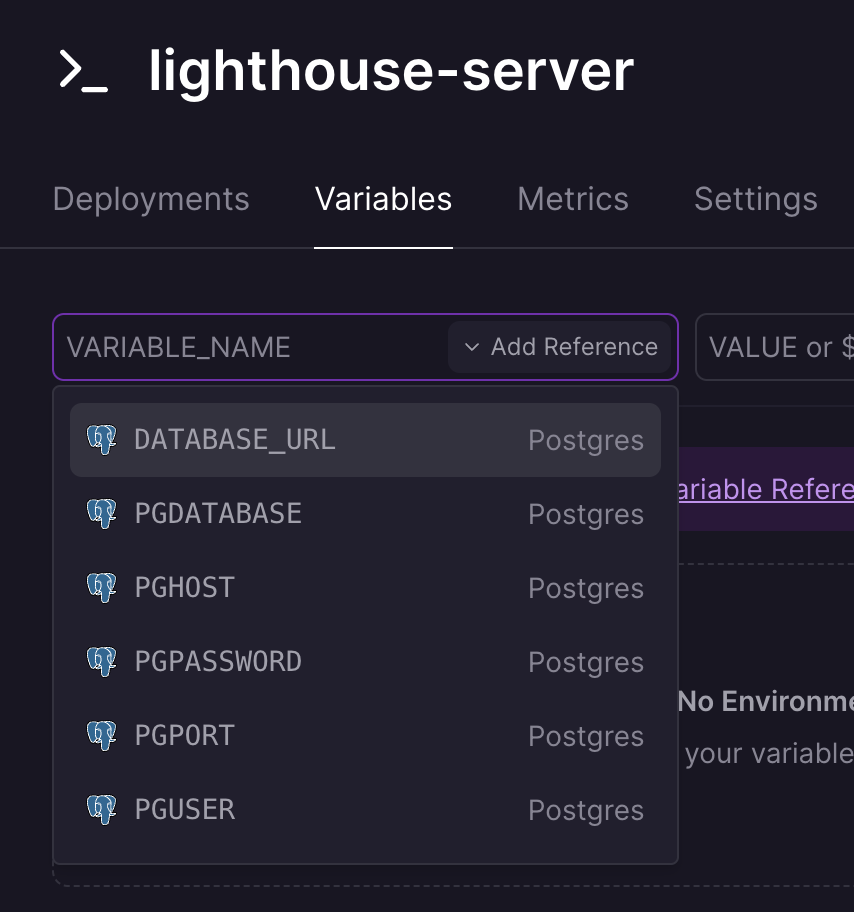

Select the `DATABASE_URL` option in the dropdown and you'll see the prefilled values:


Once you click "Add", the redeploy will get scheduled.

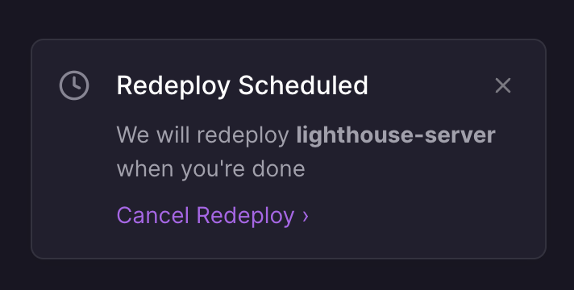

After a couple of minutes, our deployment is successful, yay! But how do we view our Lighthouse server?
Great question, let's answer it in the next section.

## Step 4 - Add a Domain on Railway

Now, we need to add a domain for our `lighthouse-server` project. Go into the `lighthouse-server` Settings tab like so:


There, you will see "Generate domain" button. Click it and you should see the new domain generated:


Now, if we visit https://lighthouse-server-production-51ca.up.railway.app/app/projects, we will see a welcome message and instructions to start the configuration of the LHCI server:

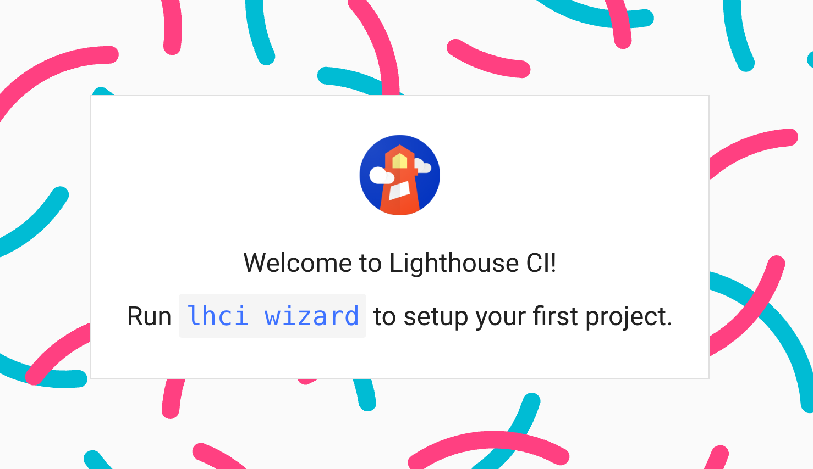

Now, let's configure the server!

## Step 5 - Configure Lighthouse CI Server

Now, we are going to step away from the `lighthouse-server` project and focus on the project we want to measure.
In my case, that's the blog you are currently reading - Pragmatic Pineapple (here's the [GitHub repo](https://github.com/nikolalsvk/blog).

I'll move into the root of the project and create a `lighthouserc.json` file to configure Lighthouse:

```json
{
  "ci": {
    "collect": {
      "url": ["http://localhost:9000"],
      "numberOfRuns": 5,
      "startServerCommand": "npm run serve"
    },
    "assert": {
      "preset": "lighthouse:no-pwa"
    },
    "upload": {
      "target": "lhci",
      "serverBaseUrl": "https://lighthouse-server-production-51ca.up.railway.app"
    },
    "headful": false
  }
}
```

This `lighthouserc.json` specifies from where to collect, what to assert, and where to upload Lighthouse results. In this case:

- We're collecting from the http://localhost:9000 after 5 runs of Lighthouse, and we are running the blog server with `npm run serve`. We're doing 5 runs to get a better mean value, just in case.
- We're asserting against the `lighthouse:no-pwa` set of assertions. That is a set of assertions from Lighthouse containing recommended thresholds for various measurements. (I had to fine-tune the assertions because some of them were breaking my build. I'll fix them one day 🤞).
- And, we're uploading to a custom LHCI server located at the URL we previously deployed with Railway https://lighthouse-server-production-51ca.up.railway.app.

The important entry in this JSON file is the `serverBaseUrl` that tells where our LHCI server is located. Now, we can run the LHCI wizard with `lhci wizard`:

```bash
$ lhci wizard

? Which wizard do you want to run? new-project
? What is the URL of your LHCI server? https://lighthouse-server-production-51ca.up.railway.app
? What would you like to name the project? pragmaticpineapple
? Where is the project's code hosted? https://github.com/nikolalsvk/blog
? What branch is considered the repo's trunk or main branch? master
Created project pragmaticpineapple (xxxx-xxxx-xxxx-xxxx-xxxx)!
Use build token xxxx-xxxx-xxxx-xxxx-xxxx to add data.
Use admin token xxxx to manage data. KEEP THIS SECRET!
```

The wizard configured the remote LHCI server and returned two tokens - build and admin token. Write down both somewhere and keep them safe.
We are going to need the build token later in this blog post.

Now, if we go to https://lighthouse-server-production-51ca.up.railway.app, there's a new project generated:

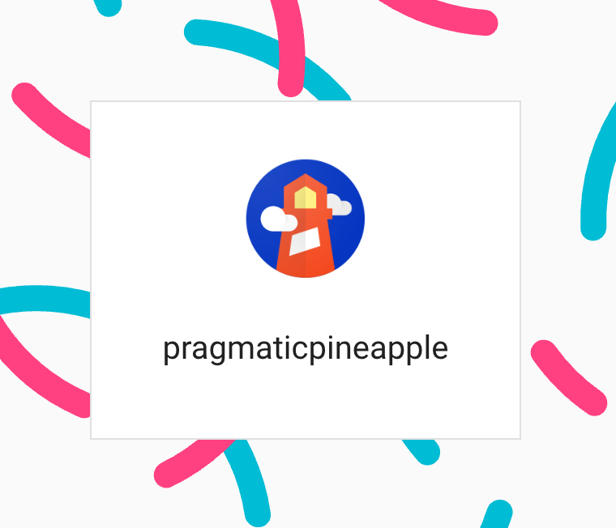

If we open the project, there's nothing there.


Because we didn't have any Lighthouse runs that sent the data to our sever, duh!
We'll fix that shortly.

## Step 6 - Recording First Lighthouse Result

You'd be tempted to run the Lighthouse CI locally, but let's hold our horses and create a proper way to do it.

LHCI is meant to be run, well, in the CI environment. My blog is hosted on GitHub, so let's configure a GitHub Action that runs the LHCI and uploads it to our freshly deployed LHCI server.

First, let's create `.github` and `.github/workflows` directories.

```bash
mkdir .github
mkdir .github/workflows
```

Then, let's add `.github/workflows/lighthouse-ci.yaml` which should look like this:

```yaml
name: Build project and run Lighthouse CI

on: [push]

jobs:
  lhci:
    name: Lighthouse CI
    runs-on: ubuntu-latest
    steps:
      - uses: actions/checkout@v3
      - name: Use Node.js 17.x
        uses: actions/setup-node@v3
        with:
          node-version: 17
          cache: "npm"
      - name: npm install
        run: |
          npm install --legacy-peer-deps
      - name: npm run build
        run: |
          npm run build
      - name: run Lighthouse CI
        run: |
          npm install -g @lhci/cli@0.12.x
          lhci autorun --upload.githubToken="$LHCI_GITHUB_TOKEN" || echo "LHCI failed!"
        env:
          LHCI_TOKEN: ${{ secrets.LHCI_TOKEN }}
          LHCI_GITHUB_TOKEN: ${{ secrets.LHCI_GITHUB_TOKEN }}
```

This action runs:

1. `npm install`
2. `npm run build` to build a production version of my blog, and,
3. `lhci autorun` that uses `lighthouserc.json` we defined earlier

One important thing is that we have to provide the `LHCI_TOKEN` to the GitHub Action. For that, we'll go into the repository Settings > Secrets and variables > Actions and click "New repository secret". It should look something like this:

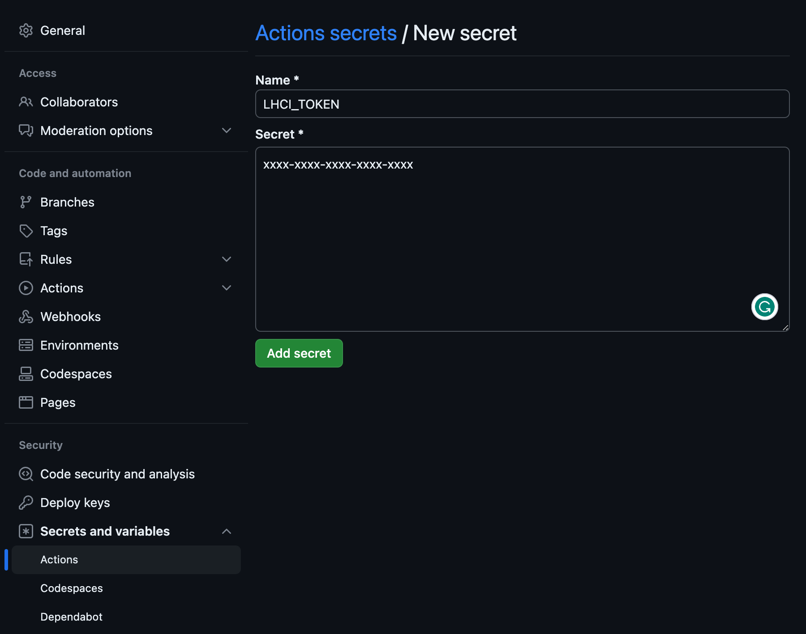

Click "Add secret" and we're good to make our first push and trigger the LHCI.

Now, whenever there's a push to my blog repo, a GitHub Action will run and report a Lighthouse score to the Lighthouse CI Server we configured in this blog post.
Depending on the project you are running, you might have a different setup than I have, but the concept is similar:

1. Prepare your project (install deps)
2. Generate the production version of the website
3. Run `lhci autorun` on it
4. Preview results on the custom LHCI server

For example, here's a finished build on GitHub:

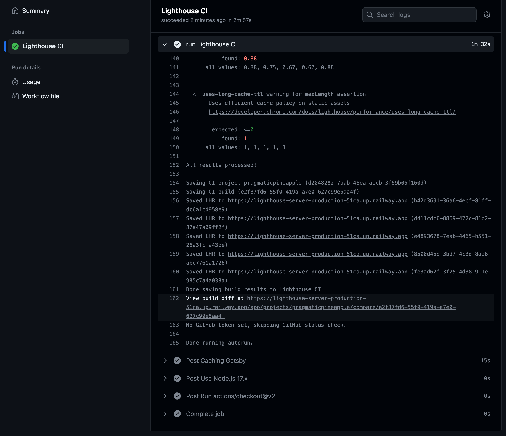

The results are reported to the LHCI server here:


Awesome, we have our LHCI server running and GitHub Actions reporting on each push to the server our Lighthouse score. Congrats if you were following and got your first result!

What next? I have a bonus step for you!

## BONUS: Post a GitHub Commit Status Check

We can have LHCI post a status check to our commits as LHCI finishes running. That's a great way to see how the Lighthouse run went without going into the GitHub Action or opening the LHCI server.Here's an example:


To get started, we need a new GitHub token with the `repo:status` allowed:

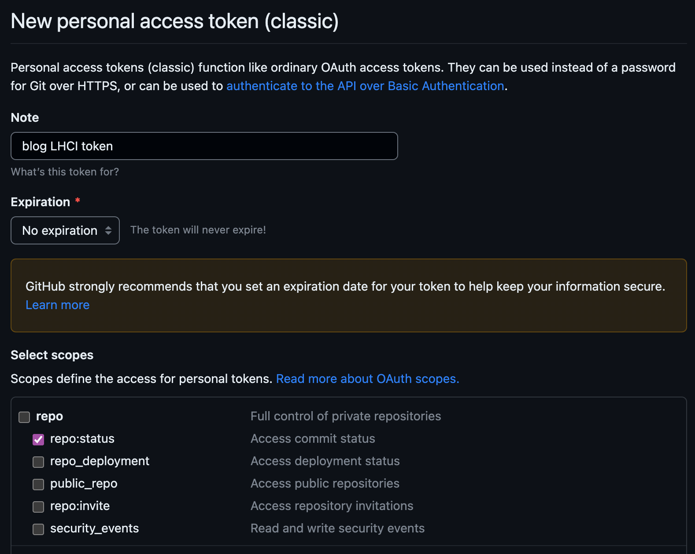

Then, we need to add a new secret `LHCI_GITHUB_TOKEN` to repository's Settings > Settings > Secrets and variables > Actions. Notice how we now have two secrets:


And, finally, let's tell `lhci` our token by editing the `.github/workflows/lighthouse-ci.yaml`:

```yaml
name: Build project and run Lighthouse CI

on: [push]

jobs:
  lhci:
    name: Lighthouse CI
    runs-on: ubuntu-latest
    steps:
      // other steps

      - name: run Lighthouse CI
        run: |
          npm install -g @lhci/cli@0.12.x
          lhci autorun --upload.githubToken="$LHCI_GITHUB_TOKEN" || echo "LHCI failed!"
        env:
          LHCI_TOKEN: ${{ secrets.LHCI_TOKEN }}
          LHCI_GITHUB_TOKEN: ${{ secrets.LHCI_GITHUB_TOKEN }}
```

We added the `--upload.githubToken="$LHCI_GITHUB_TOKEN"` option and in the `env` we made sure `LHCI_GITHUB_TOKEN` is set properly from the repository's secrets.

Now, you'll get a new commit status check whenever a Lighthouse runs for that commit, yay!


> Please note, there's an [official Lighthouse GitHub app](https://github.com/apps/lighthouse-ci) that can do a similar thing for you.

## EXTRA BONUS: Deploy lighthouse-server Automatically to Railway

Let's connect `lighthouse-server` to Railway automatically whenever we push to the repo's main branch. This will be straightforward since all we need to do is to connect the GitHub repo to a `lighthouse-server` Railway project in their UI.

If you haven't already, now is a good time to publish your LHCI configuration we worked on in step 1. You can also use the one I have over at [`lighthouse-server` repo on GitHub](https://github.com/nikolalsvk/lighthouse-server).

Inside `lighthouse-server` Settings tab in Railway, there's a section for connecting a GitHub repository like so:

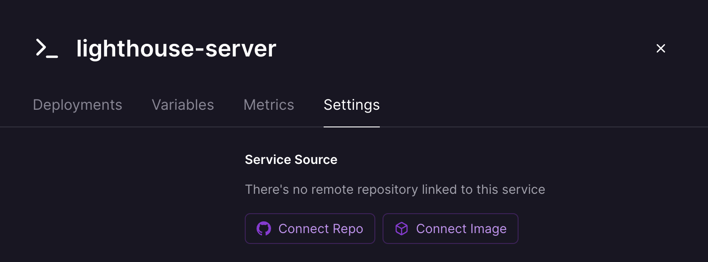

Once clicked, we'll be taken to GitHub to set up the GitHub Railway app. Here, you can allow access to all repos or just the ones you want. I selected the `lighthouse-server` GitHub repo and installed the app.

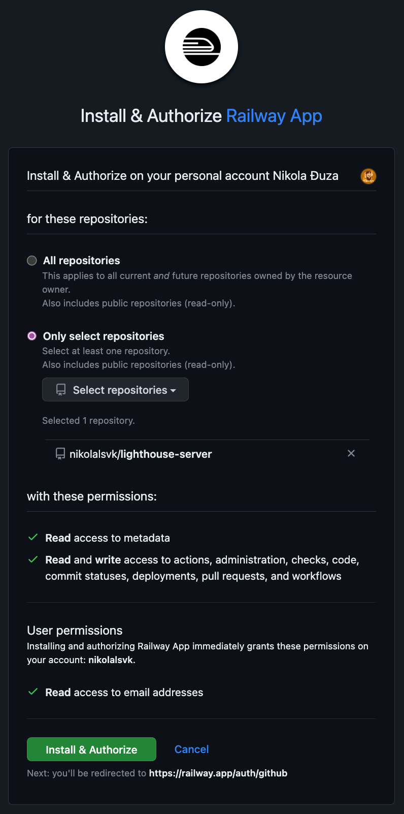

Once installed, return to the Railway `lighthouse-server` Settings tab and click "Connect Repo". Now, you should see the repos you allowed Railway to access. I selected the `lighthouse-server` GitHub repo and now everything is connected.


Now, every time I push to the repo - Railway will deploy the change, yay!


## Summing Up

And that's it! The Lighthouse CI server is now deployed and configured on Railway together with a database to store your project's runs.
Each commit will run Lighthouse, post results, and ensure your sites are fast and accessible.

You can find all the [code for the `lighthouse-server` on GitHub here](https://github.com/nikolalsvk/lighthouse-server).
And the [PR where I added the Lighthouse workflow to my blog](https://github.com/nikolalsvk/blog/pull/122).

Now, all I (and probably you) need to do is to ramp up that Lighthouse score and keep away from the rocks ⛰ 🔦 🚢.

Thanks for reading, and I'll catch you in the next one.

Cheers.
